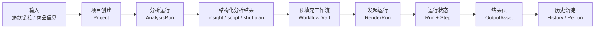
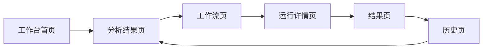
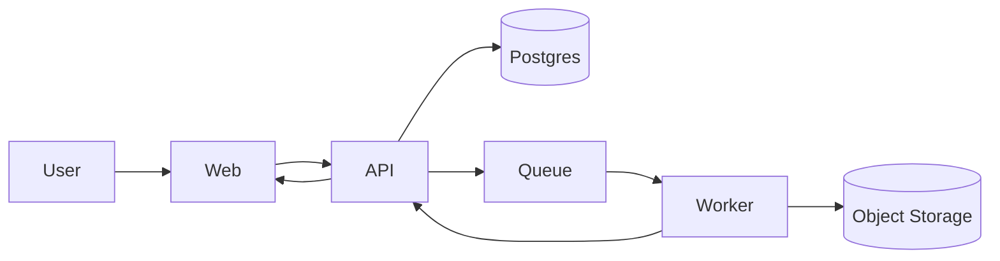
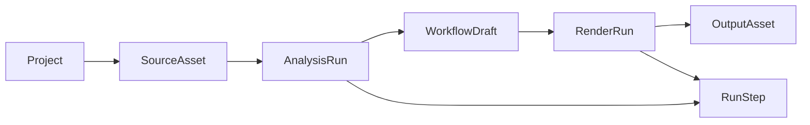
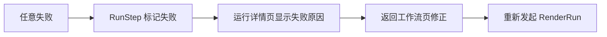

# 全新项目 主链图

更新日期：2026-04-23
状态：Draft v0.1

关联文档：

- [全新项目 MVP 定义与 PRD 初稿](./product-mvp-prd.md)
- [全新项目 信息架构与页面草图](./information-architecture-and-page-wireframes.md)
- [全新项目 技术方案与系统架构初稿](./technical-architecture-draft.md)
- [全新项目 Schema 与 Contract 冻结清单](./schema-and-contract-freeze.md)

## 1. 主链一句话

`输入 -> 分析 -> 预填充工作流 -> 运行 -> 结果 -> 历史`

这是当前 MVP 唯一主线。

## 2. 产品主链图

## 3. 页面主链图

说明：

- 首页不允许直接跳空白画布
- 首页主按钮必须先进入分析链路
- 历史页打开项目时，默认回到最近有效页面

## 4. 系统主链图

## 5. 数据对象主链

## 6. 失败回退链

规则：

- 失败后不能丢失前序中间产物
- 失败后默认回到工作流页，而不是回首页
- 历史里必须能看到失败记录

## 7. 当前冻结说明

当前阶段，任何实现都不能偏离这条主链：

`输入 -> 分析 -> 预填充工作流 -> 运行 -> 结果 -> 历史`

这意味着当前不允许把主链改成：

- 输入 -> 空白节点画布 -> 用户自己搭
- 输入 -> 直接大模型生成成片 -> 无中间结构
- 输入 -> 多模型市场选择 -> 再进入流程

## 8. 当前结论

以后如果要判断一个新功能现在能不能做，就先问一个问题：

`它是在强化这条主链，还是在把主链带偏？`

只有前者，才应该进入当前阶段。
